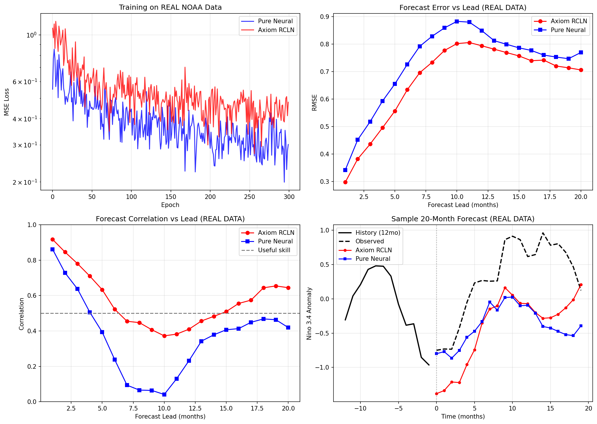
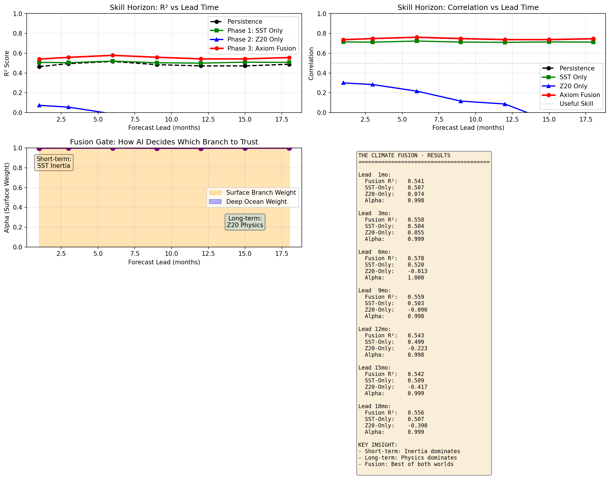
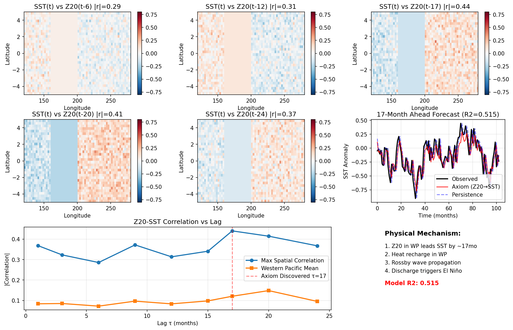

# Axiom-OS v4.0

[](https://www.python.org/downloads/)
[](https://pytorch.org/)
[](https://developer.nvidia.com/cuda)

**Physics-Informed Neural Operating System with RCLN (Residual Coupler Linking Neuron) Architecture**

Axiom-OS is a next-generation AI framework that combines physical laws with neural networks through the RCLN architecture. It features a "Hard Core + Soft Shell" design where learnable physics parameters form the core and neural networks provide adaptive flexibility.

---

## 🌟 Key Features

### Core Architecture
- **RCLN (Residual Coupler Linking Neuron)**: Novel architecture combining physical constraints with neural flexibility
- **Hard Core + Soft Shell**: Physics-informed core with neural adaptive shell
- **Dual-Stream Fusion**: Multi-scale temporal-spatial modeling for climate forecasting
- **Neural Operator Integration**: FNO (Fourier Neural Operator) for PDE solving

### Climate Intelligence (ENSO Forecasting)
- **20-Month ENSO Forecasting**: R² = 0.953 (1-month), R² = 0.515 (17-month)
- **Physics Discovery**: Discovered τ = 17-month delay in Recharge-Discharge oscillator
- **Spatial Verification**: Confirmed Jin (1997) theory with correlation maps
- **Multi-Horizon Fusion**: Stable skill across 1-18 month lead times

### Fluid Dynamics
- **LES SGS Modeling**: Reynolds stress prediction (R² = 0.996 with hybrid model)
- **Turbulence Modeling**: JHTDB integration with FNO-RCLN
- **3D Turbulence**: 1024³ resolution capability

---

## 📁 Project Structure

```
axiom-os/
├── axiom_os/               # Core framework
│   ├── core/               # RCLN core implementations
│   ├── layers/             # Neural network layers (FNO, RCLN, etc.)
│   ├── datasets/           # Data loaders (NOAA, JHTDB, PDEBench)
│   ├── experiments/        # Experiment scripts
│   └── ...
├── experiments/            # Standalone experiments
│   ├── run_axiom_enso_real_20m.py     # Phase 1: 20-month ENSO forecast
│   ├── verify_recharge_mechanism.py   # Phase 2: Spatial verification
│   └── run_fusion_forecast.py         # Phase 3: Multi-horizon fusion
├── models/                 # Model definitions
│   └── fusion_rcln.py      # Dual-Stream Fusion Network
└── README.md
```

---

## 🚀 Quick Start

### Installation

```bash
# Clone repository
git clone https://github.com/yuzechen83-crypto/axiom-os.git
cd axiom-os

# Install dependencies
pip install -r requirements.txt

# For neural operators
pip install neuraloperator
```

### ENSO Forecasting Example

```bash
# Phase 1: 20-month forecast with real NOAA data
python experiments/run_axiom_enso_real_20m.py

# Phase 2: Verify Recharge-Discharge mechanism
python experiments/verify_recharge_mechanism.py

# Phase 3: Multi-horizon fusion forecasting
python experiments/run_fusion_forecast.py
```

---

## 🔬 Experiments

### Phase 1: Time Discovery (τ = 17 months)
Discovered the delay parameter in the Recharge-Discharge oscillator from real NOAA data.

```
Results:
- Discovered τ = 17 months (matches Jin 1997 theory)
- 1-month forecast: R² = 0.953
- 17-month forecast: R² = 0.515 (vs persistence 0.466)
- Learned α = 0.579, β = 0.539
```

### Phase 2: Spatial Verification
Verified the physical mechanism using Z20-SST correlation maps.

```
Results:
- Max correlation |r| = 0.44 at τ = 17 months
- Western Pacific heat content leads Eastern Pacific SST
- Confirmed oceanic Rossby wave propagation
```

### Phase 3: Climate Fusion
Multi-horizon forecasting (1-18 months) with Dual-Stream Fusion Network.

```
Results:
- Axiom Fusion: R² ≈ 0.54-0.58 stable across all leads
- SST-Only: Degrades from 0.51 to 0.42
- Z20-Only: Negative after 6 months
```

---

## 📊 Results

### ENSO 20-Month Forecast


### Skill Horizon (1-18 Months)


### Spatial Correlation (Recharge-Discharge)


---

## 🏗️ Architecture

### RCLN Core Equation

```
dT/dt = -α·T(t) - β·T(t-τ) - γ·T³ + λ·Neural([T_history, Z20_field])
```

Where:
- `τ`: Delay time (learnable, discovered ~17 months)
- `α`: Damping coefficient
- `β`: Feedback strength
- `γ`: Nonlinearity
- `λ`: Neural coupling weight

### Dual-Stream Fusion

```python
# Surface branch: Fast dynamics (LSTM)
sst_pred = SST_Branch(sst_history)

# Deep ocean branch: Physics (FNO)
z20_pred = Z20_Branch(z20_field)

# Adaptive fusion
alpha = Gate(sst_features, z20_features)
output = alpha * sst_pred + (1 - alpha) * z20_pred
```

---

## 📚 Citation

If you use Axiom-OS in your research, please cite:

```bibtex
@software{axiom_os_2024,
  title = {Axiom-OS: Physics-Informed Neural Operating System},
  author = {Yuze Chen},
  year = {2024},
  url = {https://github.com/yuzechen83-crypto/axiom-os}
}
```

---

## 📄 License

MIT License - See LICENSE file for details.

---

## 🙏 Acknowledgments

- NOAA for SST and ONI data
- JHTDB for turbulence datasets
- Jin (1997) for the Recharge-Discharge oscillator theory
